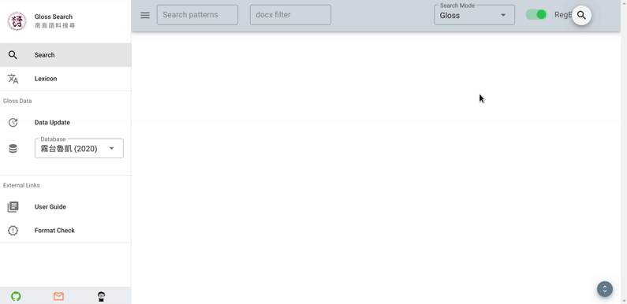

# 搜尋模式

{docsify-updated}

**Gloss Search** 提供 **3 種**搜尋模式，分別對映至一個句子轉寫的 3 個部份 (見 [1.1 內文格式](prepare-data#content-format) 第二點)：

1. **原始族語** (未切分)
1. **Gloss lines** (切分且對齊之_族語_、_英文_、_中文_)
1. **Free lines** (中英翻譯及註釋)

## 2.1 &nbsp; 多重搜尋交集

**Gloss/Free lines** 搜尋模式支援使用逗點 (`,`) 分隔多個搜尋字串。一個句子必須**同時**具有這些符合的搜尋字串，才會被回傳。例如，若想查找**同時**具有 _主格_ 與 _斜格_ 的句子，可以選擇 **Gloss lines** 搜尋模式，再輸入 `主格, 斜格`：

## 2.2 &nbsp; 限縮搜尋範圍 :id=docx-filter

搜尋欄右側的欄位 (`docx filter`) 可用於限縮文件搜尋範圍。只要輸入檔案名稱 (一部份)，就可以將搜尋範圍限縮在符合搜尋字串的這些檔案。例如，由於檔名是依照**日期**命名，因此可以透過這個檔名規則將語料搜尋的範圍限制在某天 (e.g., `0528`)、某月 (e.g., `202005`:
_5月_)
或甚至某個日期範圍 (需使用 [Regular Expression](regex.md), e.g., `202005(28|30)`： _5/28 與 5/30_)。

!> 當搜尋字串 (e.g., `主格`, `a`) 回傳**大量**句子時，**需一段時間**才能顯示結果 (快慢依電腦性能與記憶體用量而定。通常超過 200 即很多)。建議**先限縮**文件搜尋範圍，**再搜尋**會回傳大量資料的字串。

